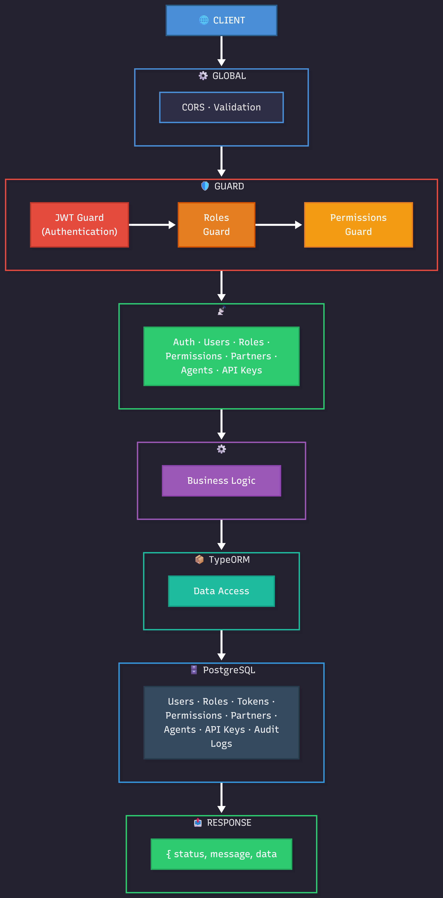

# Centralized Auth

Centralized Authentication & Authorization backend for the Agriculture Monitoring Platform. Manages users, partners, roles, permissions, and API keys across 6 interconnected dashboards.

Built with **NestJS 11** + **TypeORM** + **PostgreSQL**.

---

## Architecture

<p align="center">
  
</p>

**Request Flow:**

1. **Client** sends a request (web dashboard, mobile app, or third-party API)
2. **Global Layer** applies CORS and request validation
3. **Guard Chain** runs in order:
   - **JWT Guard** — verifies the Bearer token is valid (authentication)
   - **Roles Guard** — checks the user has the required role for the endpoint (authorization)
4. **Controller** receives the validated request and routes to the correct module (Auth, Users, Roles, Partners, Agents, API Keys)
5. **Service Layer** executes business logic
6. **TypeORM** handles database queries
7. **PostgreSQL** stores all data across 10 tables
8. **Response** returns standardized JSON: `{ status, message, data }`

---

## Tech Stack

| Component | Technology |
|-----------|-----------|
| Framework | NestJS 11.x |
| ORM | TypeORM 0.3.x |
| Database | PostgreSQL |
| Auth | JWT (access + refresh tokens) |
| Password Hashing | bcrypt |
| API Docs | Swagger (auto-generated) |
| Testing | Jest + Supertest (E2E pipeline) |

---

## Database Schema (10 Tables)

```
partners              users                 roles
├── partner_id (PK)   ├── user_id (PK)      ├── role_id (PK)
├── name              ├── username (UNIQUE)  ├── dashboard (VARCHAR)
├── slug (UNIQUE)     ├── email (UNIQUE)     ├── code
├── allowed_dashboards├── password_hash      ├── name
│   (TEXT[])          ├── is_system_user     ├── permissions (JSONB)
├── settings (JSONB)  ├── partner_id (FK)    └── is_system_role
└── is_active         └── is_active

user_roles            refresh_tokens        agents
├── user_role_id (PK) ├── token_id (PK)     ├── agent_id (PK)
├── user_id (FK)      ├── user_id (FK)      ├── user_id (FK, optional)
├── role_id (FK)      ├── token_hash        ├── partner_id (FK)
├── granted_by (FK)   ├── expires_at        ├── msisdn
├── granted_at        └── revoked_at        └── status
└── revoked_at

api_keys              audit_logs            test_report_runs / test_report_results
├── api_key_id (PK)   ├── log_id (PK)       (E2E test reporting tables)
├── partner_id (FK)   ├── user_id (FK)
├── key_hash          ├── action
├── scopes (TEXT[])   ├── resource_type
└── is_active         └── details (JSONB)
```

**Key design decisions:**
- **Roles have JSONB permissions** — no separate permissions table, flexible key-value pairs per role
- **`allowed_dashboards` on partners** — simple TEXT array controls which dashboards a partner can access
- **One role per dashboard per user** — enforced by application logic via `user_roles`
- **System users** have `is_system_user = true` and nullable `partner_id` (BKK internal staff)
- **Audit trail** on role assignments (`granted_by`, `granted_at`, `revoked_at`)

---

## 6 Dashboards

| # | Dashboard | Purpose |
|---|-----------|---------|
| 1 | **Crop Monitoring Portal** | Partner-based remote farm health monitoring |
| 2 | **Insights Dashboard** | Central layer repository with cross-dashboard analytics |
| 3 | **Cane Monitoring Dashboard** | Sugar mill operations, harvest tracking |
| 4 | **Admin Dashboard** | Master control panel for all dashboards and users |
| 5 | **Field Survey Dashboard** | Agent management, QA, payroll, data pipeline |
| 6 | **Field Survey App** | Mobile data collection, surveys, offline sync |

Each dashboard has its own set of roles (e.g. `system_admin`, `partner_admin`, `general_user`). A partner's `allowed_dashboards` array controls which dashboards their users can access.

---

## API Endpoints

| Module | Endpoints | Description |
|--------|-----------|-------------|
| **Auth** | `POST /api/auth/login`, `refresh`, `logout`, `logout-all`, `GET /me` | JWT login, token rotation, session management |
| **Partners** | CRUD `/api/partners` + `PATCH allowed_dashboards` | Organization management with dashboard access control |
| **Users** | CRUD `/api/users` + password change | User management with partner scoping |
| **Roles** | CRUD `/api/roles` + `assign`, `revoke`, `GET /user/:id` | Role management with JSONB permissions |
| **Permissions** | CRUD `/api/permissions` + user overrides, partner toggles | Permission registry, direct grants/denies, feature toggles |
| **Agents** | CRUD `/api/agents` | Field agent management |
| **API Keys** | `POST`, `GET`, `DELETE` `/api/api-keys` | Third-party API access with hashed keys |
| **Audit** | `GET /api/audit` | Audit log queries (who did what, when) |
| **Test Reports** | `GET /api/test-reports/latest/html` | Browser-viewable E2E test reports |

All endpoints return: `{ status: "success" | "error", message: "...", data: {...} }`

Swagger docs available at: `http://localhost:3001/api/docs`

---

## Getting Started

### Prerequisites

- Node.js 18+
- PostgreSQL 14+
- npm

### Setup

```bash
# 1. Install dependencies
npm install

# 2. Create database and run schema
psql -U postgres -c "CREATE DATABASE centralized_auth;"
psql -U postgres -d centralized_auth -f sql/001_auth_schema.sql
psql -U postgres -d centralized_auth -f sql/003_seed_data.sql

# 3. Create superadmin user
psql -U postgres -d centralized_auth -c "
INSERT INTO users (username, email, password_hash, full_name, is_active, is_system_user)
VALUES ('superadmin', 'superadmin@bkk.local',
        '\$2b\$12\$lZ17W0XKGvPcyFW7LSK2teFp4nyL9atJ86swRjcfg9h/lrYreM/gy',
        'Super Admin', true, true);
"
# Password: Password@123

# 4. Configure environment
# Copy .env.example to .env.local and set DB_HOST, DB_PORT, DB_USER, DB_PASSWORD, DB_NAME

# 5. Start the server
npm run start:dev
```

Server runs at `http://localhost:3001`

---

## Testing

```bash
# Run the E2E test pipeline (57 tests across 10 modules)
npm run dev:test
```

Tests run sequentially, create test data, validate all endpoints, save an HTML report to the database, then clean up all test data automatically.

View test reports at: `http://localhost:3001/api/test-reports/latest/html`

---

## Project Structure

```
src/
├── common/
│   ├── decorators/          # @Roles() decorator
│   ├── filters/             # AllExceptionsFilter
│   ├── guards/              # JwtAuthGuard, RolesGuard
│   ├── interceptors/        # Response transformer
│   └── interfaces/          # JWT payload types
├── entities/                # TypeORM entities (Partner, User, Role, etc.)
├── modules/
│   ├── auth/                # Login, refresh, logout, JWT strategy
│   ├── partners/            # Partner CRUD + dashboard access
│   ├── users/               # User CRUD + password management
│   ├── roles/               # Role CRUD + assign/revoke
│   ├── permissions/         # Permission registry + user overrides + partner toggles
│   ├── agents/              # Field agent CRUD
│   ├── api-keys/            # API key management
│   ├── audit/               # Audit log queries
│   └── test-reports/        # E2E test report viewer
├── app.module.ts            # Root module
└── main.ts                  # Bootstrap + Swagger setup

sql/
├── 001_auth_schema.sql      # CREATE TABLE (10 tables)
└── 003_seed_data.sql        # Seed dashboards + 20 roles

docs/
├── architecture.png         # Architecture diagram
├── Explanation.md           # Manager-friendly schema explanation
├── Process.md               # Complete technical documentation
└── Testing.md               # E2E testing guide

test/
└── api-pipeline.e2e-spec.ts # 57 E2E tests
```

---

## How It Works

### Creating a Partner + User + Agent

```
1. POST /api/partners
   → Create org with allowedDashboards: ["crop_monitoring", "insights"]

2. POST /api/users
   → Create user with partnerId from step 1

3. POST /api/roles/assign
   → Assign a role (e.g. crop_monitoring partner_admin) to the user

4. POST /api/agents (optional)
   → Create field agent under the partner
```

### Authentication Flow

```
Login (username + password)
  → Validate credentials (bcrypt compare)
  → Generate JWT access token (15 min) + refresh token (7 days)
  → Store refresh token hash in DB
  → Return both tokens

Protected Request
  → JWT Guard extracts + verifies access token
  → Roles Guard checks user's roles match endpoint requirements
  → Request proceeds to controller

Token Refresh
  → Send refresh token to /api/auth/refresh
  → Old token revoked, new pair issued (rotation)
```

---

## Documentation

| Document | Description |
|----------|-------------|
| [Explanation.md](docs/Explanation.md) | Database schema explained in simple words (for managers) |
| [Process.md](docs/Process.md) | Complete technical documentation |
| [Testing.md](docs/Testing.md) | E2E testing guide with all 57 test cases |
